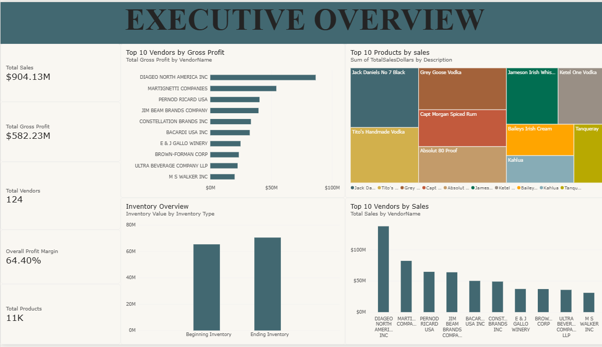
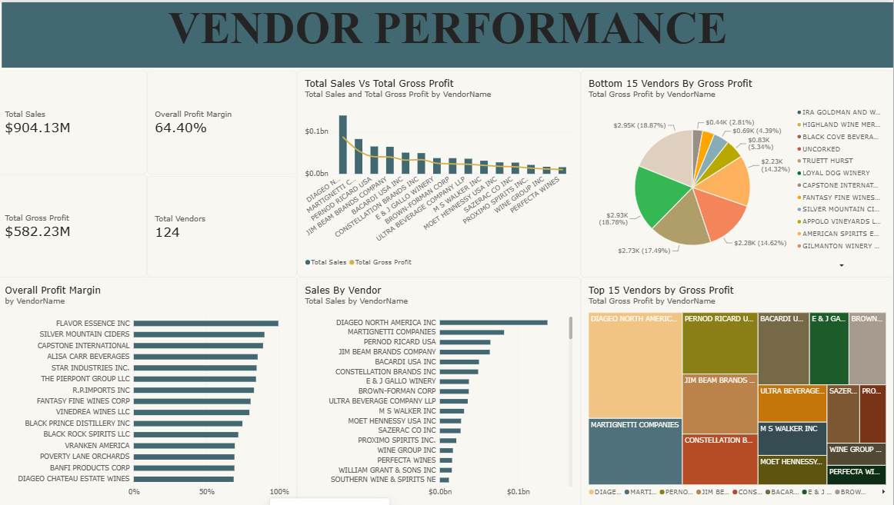
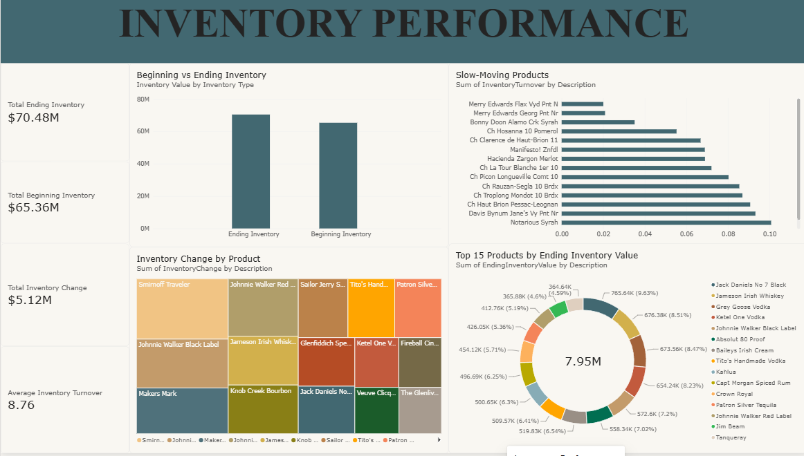

````markdown
# 📊 Vendor Performance Analysis

An end-to-end data analytics project designed to evaluate **vendor performance, product profitability, and inventory efficiency** using **Python, Pandas, SQL, MySQL, Power BI, and DAX**.

This project follows a complete real-world analytics workflow, starting from raw transactional data and data-quality validation, progressing through SQL-based data transformation and business analysis, and ending with an interactive Power BI dashboard designed to support business decision-making.

---

## 📌 Project Overview

Managing a large number of vendors, products, purchases, and inventory records can make it difficult for a business to identify which vendors are truly performing well.

A vendor generating high sales revenue may not necessarily generate high profit. Similarly, products with strong sales may have weak margins, while products with low inventory turnover may represent capital tied up in slow-moving stock.

The goal of this project is to bring these different aspects together and provide a consolidated analytical view of:

- Vendor sales performance
- Vendor profitability
- Product sales performance
- Product profitability
- Profit margins
- Beginning and ending inventory
- Inventory changes
- Inventory turnover
- Slow-moving inventory
- Products and vendors requiring further attention

The project demonstrates how raw business data can be transformed into meaningful business insights through a structured data analytics pipeline.

---

## 🎯 Business Objectives

The analysis was designed to answer the following business questions:

### Vendor Performance

- Which vendors generate the highest sales?
- Which vendors generate the highest gross profit?
- Which vendors have the strongest profit margins?
- Which vendors generate high revenue but comparatively low profit?
- Which vendors are underperforming?

### Product Performance

- Which products generate the highest revenue?
- Which products generate the highest gross profit?
- Which products have strong or weak profit margins?
- Which products generate low or negative profitability?
- Which products contribute significantly to overall business performance?

### Inventory Performance

- How does inventory change between the beginning and end of the year?
- Which products experience the largest inventory changes?
- Which products have high ending inventory values?
- Which products have low inventory turnover?
- Which products may represent slow-moving inventory?

---

## 🔄 Project Workflow

The project follows an end-to-end analytics workflow:

```text
Raw Data
   ↓
Python / Pandas
   ↓
Data Understanding
   ↓
Data Cleaning & Validation
   ↓
Exploratory Data Analysis
   ↓
MySQL / SQL
   ↓
Data Transformation & Aggregation
   ↓
Analytical Datasets
   ↓
Power BI
   ↓
DAX Measures & Data Modelling
   ↓
Interactive Dashboard
   ↓
Business Insights
````

The workflow separates data preparation, transformation, analysis, and visualization into different stages, making the project easier to understand and reproduce.

---

# 🗂️ Repository Structure

```text
Vendor_Performance_Analysis/
│
├── Dashboard/
│   └── vendor performance analysis.pbix
│
├── Images/
│   ├── Executive_overview.png
│   ├── Vendor_performance.png
│   ├── product performance.png
│   └── Inventory_performance.png
│
├── Notebook/
│   └── 01_data_understanding.ipynb
│
├── Sql/
│   └── vendor_performance_analysis.sql
│
└── README.md
```

### Folder Description

| Folder / File | Description                                                                                          |
| ------------- | ---------------------------------------------------------------------------------------------------- |
| `Dashboard/`  | Contains the final Power BI dashboard                                                                |
| `Images/`     | Dashboard screenshots used for documentation                                                         |
| `Notebook/`   | Python notebook used for data understanding, validation, cleaning, and exploration                   |
| `Sql/`        | SQL scripts used for database creation, transformation, aggregation, and analytical table generation |
| `README.md`   | Project documentation                                                                                |

The original raw and processed datasets are not included in this repository because of their large file sizes.

---

# 📊 Dataset

The project works with multiple datasets representing different parts of the business.

| Dataset                 | Description                                                |
| ----------------------- | ---------------------------------------------------------- |
| **Sales**               | Transaction-level sales information                        |
| **Purchases**           | Vendor purchase transactions                               |
| **Beginning Inventory** | Inventory position at the beginning of the analysis period |
| **Ending Inventory**    | Inventory position at the end of the analysis period       |
| **Purchase Prices**     | Product-level purchase price information                   |
| **Vendor Invoice**      | Vendor invoice and freight-related information             |

The sales dataset contains **more than 12.8 million records**, making the project useful for demonstrating practical data-processing and analytical techniques on a relatively large transactional dataset.

The sales data covers the period:

```text
January 1, 2024 → December 31, 2024
```

---

# 🐍 Python & Pandas

Python was used as the first major stage of the analytics workflow.

The notebook:

```text
Notebook/01_data_understanding.ipynb
```

contains the initial data investigation, validation, exploration, and preparation.

## Data Loading

The source datasets were loaded using Python and Pandas.

The first objective was not immediately to build charts or calculate business metrics, but to understand the structure and quality of the underlying data.

---

## 🔍 Data Understanding

The datasets were inspected to understand:

* Number of rows and columns
* Column names
* Data types
* Date ranges
* Unique vendors
* Unique products
* Missing values
* Duplicate records
* Numerical fields
* Quantity distributions
* Sales values
* Purchase values
* Inventory characteristics

This stage helped establish how the different datasets could be connected and used together.

---

## 🧹 Data Quality Checks

Several validation checks were performed before moving into the SQL stage.

These included:

* Missing-value analysis
* Duplicate detection
* Data-type validation
* Quantity validation
* Price validation
* Purchase amount validation
* Vendor consistency checks
* Product consistency checks
* Matching products with purchase-price information
* Checking relationships between sales and purchasing data

These checks were important because incorrect or inconsistent source data could lead to misleading profitability and inventory calculations.

---

# 📈 Exploratory Data Analysis

Python was also used to perform initial exploratory analysis.

The analysis explored:

* Top vendors by sales
* Vendor sales distribution
* Product sales performance
* Purchasing patterns
* Inventory characteristics
* Vendor-product relationships
* Revenue distribution
* Potential data-quality issues

For example, vendor-level sales aggregation was used to identify the vendors contributing the highest sales revenue.

This exploratory stage helped determine which business questions would be most useful to investigate further using SQL and Power BI.

---

# 🗄️ SQL & MySQL

After understanding and validating the data using Python, the datasets were moved into a MySQL database for structured transformation and analysis.

## Database

```text
vendor_performance_analysis
```

## Main Tables

```text
sales
purchases
begin_inventory
end_inventory
purchase_prices
vendor_invoice
```

SQL was used for the main analytical transformation stage of the project.

---

## 🔧 SQL Operations

The SQL workflow includes:

* Database creation
* Table creation
* Data loading
* Data joining
* Aggregations
* Vendor-level analysis
* Product-level analysis
* Inventory analysis
* Profitability calculations
* Inventory turnover calculations
* Analytical dataset creation

The complete SQL workflow is available in:

```text
Sql/vendor_performance_analysis.sql
```

---

# 📋 Analytical Datasets

Three main analytical datasets were created for the Power BI dashboard.

These datasets were designed to simplify the Power BI data model and provide clean, business-ready data for visualization.

---

## 1. Vendor Performance

The `vendor_performance` dataset contains vendor-level metrics.

### Main Fields

* Vendor Number
* Vendor Name
* Total Sales
* Total Purchase Cost
* Gross Profit
* Profit Margin

This dataset is used to compare vendors based on revenue, profitability, and margins.

---

## 2. Product Performance

The `product_performance` dataset contains product-level metrics.

### Main Fields

* Brand
* Product Description
* Total Sales
* Total Purchase Cost
* Gross Profit
* Profit Margin

This dataset allows products to be compared based on revenue generation and profitability.

---

## 3. Inventory Performance

The `inventory_performance` dataset contains inventory-level metrics.

### Main Fields

* Brand
* Product Description
* Beginning Inventory Value
* Ending Inventory Value
* Inventory Change
* Average Inventory
* COGS
* Inventory Turnover

This dataset is used to analyze inventory movement and identify potentially slow-moving products.

---

# 📐 Key Business Metrics

The project uses several important business metrics to evaluate profitability and inventory efficiency.

---

## 💰 Gross Profit

Gross profit measures the amount remaining after subtracting the cost of goods sold from sales revenue.

```text
Gross Profit = Sales Revenue − Cost of Goods Sold
```

Gross profit allows vendors and products to be compared based on the actual profit generated rather than revenue alone.

---

## 📊 Cost of Goods Sold

For product-level analysis, COGS was calculated using:

```text
COGS = Sales Quantity × Purchase Price
```

Purchase prices were matched with sales products using the available product/brand relationships.

---

## 📈 Profit Margin

Profit margin measures gross profit relative to sales revenue.

```text
Profit Margin = (Gross Profit / Sales Revenue) × 100
```

Profit margin provides additional context when comparing vendors and products with different sales volumes.

A vendor with lower sales can still be attractive if it generates a stronger margin.

---

## 📦 Average Inventory

Average inventory was calculated as:

```text
Average Inventory =
(Beginning Inventory + Ending Inventory) / 2
```

Average inventory provides the inventory base used for calculating inventory turnover.

---

## 🔄 Inventory Turnover

Inventory turnover measures how efficiently inventory is being converted into sales relative to the inventory held.

```text
Inventory Turnover =
COGS / Average Inventory
```

A lower inventory turnover can indicate that inventory is moving more slowly relative to the amount of inventory being held.

This makes inventory turnover useful for identifying potentially slow-moving products.

---

# 📊 Power BI Dashboard

The final analytical datasets were imported into Power BI to create an interactive four-page dashboard.

The dashboard combines:

* KPI cards
* Bar charts
* Comparisons
* Trend-style visualizations
* Tables
* Vendor analysis
* Product analysis
* Inventory analysis
* DAX measures
* Interactive filtering

The dashboard is designed to provide both an executive-level overview and detailed analytical views.

---

# 1️⃣ Executive Overview

The Executive Overview provides a high-level summary of the overall business performance.

### KPI Cards

* Total Sales
* Total Gross Profit
* Overall Profit Margin
* Total Vendors
* Total Products

### Analysis

The page includes visualizations for:

* Top vendors by sales
* Top vendors by gross profit
* Top products by sales
* Beginning vs Ending Inventory

This page is designed to provide a quick understanding of the overall performance of the business.

### Dashboard Preview



---

# 2️⃣ Vendor Performance

The Vendor Performance page focuses specifically on vendor-level performance.

### KPI Cards

* Total Sales
* Total Gross Profit
* Overall Profit Margin
* Total Vendors

### Analysis

The page examines:

* Total sales by vendor
* Gross profit by vendor
* Profit margin by vendor
* Top vendors by sales compared with gross profit
* Bottom-performing vendors by gross profit

This allows the user to distinguish between vendors that generate high revenue and vendors that actually generate strong profitability.

### Dashboard Preview



---

# 3️⃣ Product Performance

The Product Performance page focuses on product-level revenue and profitability.

### KPI Cards

* Total Sales
* Total Gross Profit
* Total Products

### Analysis

The page includes:

* Top products by sales
* Top products by gross profit
* Sales vs Gross Profit comparison
* Bottom products by gross profit

This helps identify products that are major contributors to revenue as well as products that may require closer profitability analysis.

### Dashboard Preview


---

# 4️⃣ Inventory Performance

The Inventory Performance page focuses on inventory levels and efficiency.

### KPI Cards

* Total Beginning Inventory
* Total Ending Inventory
* Total Inventory Change
* Average Inventory
* Inventory Turnover

### Analysis

The page examines:

* Beginning vs Ending Inventory
* Products with the largest inventory changes
* Slow-moving products based on inventory turnover
* Products with the highest ending inventory values

This provides visibility into inventory that may be tying up working capital.

### Dashboard Preview



---

# 🔎 Key Business Insights

## Vendor Performance

High sales volume does not necessarily mean high profitability.

Comparing sales, gross profit, and profit margin provides a more complete picture of vendor performance.

A vendor may contribute significantly to revenue while generating a comparatively weaker margin, making profitability an important factor when evaluating vendor relationships.

---

## Product Performance

A relatively small group of products contributes significantly to overall sales and gross profit.

Identifying these high-performing products helps businesses understand which products are major contributors to overall financial performance.

At the same time, low-performing products can be investigated for pricing, purchasing, demand, or inventory-related issues.

---

## Profitability

Profit margin provides additional context beyond total revenue.

Looking only at sales can hide differences in profitability between vendors and products.

By combining revenue, gross profit, and profit margin, the analysis provides a more balanced view of financial performance.

---

## Inventory

Comparing beginning and ending inventory helps identify how inventory levels changed during the analysis period.

Large increases in inventory may indicate additional capital being tied up in stock, while significant decreases may indicate stronger inventory movement.

Products with low inventory turnover may indicate slow-moving inventory and potentially higher holding costs.

---

# 🛠️ Tools & Technologies

The project uses the following technologies:

| Technology           | Purpose                                                    |
| -------------------- | ---------------------------------------------------------- |
| **Python**           | Data processing and analysis                               |
| **Pandas**           | Data loading, cleaning, validation, and aggregation        |
| **Jupyter Notebook** | Data exploration and documentation                         |
| **MySQL**            | Database storage and analytical processing                 |
| **SQL**              | Data transformation, joins, aggregations, and calculations |
| **Power BI**         | Interactive dashboard and reporting                        |
| **DAX**              | Measures and business calculations                         |
| **Git**              | Version control                                            |
| **GitHub**           | Project documentation and repository management            |

---

# 🧠 Skills Demonstrated

This project demonstrates practical experience in:

### Data Analysis

* Data cleaning
* Data validation
* Exploratory Data Analysis
* Large dataset processing
* Business metric development
* Data interpretation

### Python

* Pandas
* DataFrame manipulation
* Aggregation
* Missing-value analysis
* Duplicate detection
* Data validation
* Exploratory analysis

### SQL

* Database design
* Table creation
* Joins
* Aggregations
* Grouping
* Calculated metrics
* Vendor-level analysis
* Product-level analysis
* Inventory analysis

### Business Intelligence

* Power BI data modelling
* DAX measures
* KPI development
* Dashboard design
* Interactive reporting
* Business-focused visualization

### Business Analytics

* Vendor performance analysis
* Product profitability analysis
* Profit margin analysis
* Inventory analysis
* Inventory turnover analysis
* Slow-moving inventory identification
* Business insight generation

---

# 🚀 Project Outcome

This project transforms large-scale transactional data into a structured analytical solution.

The workflow begins with raw sales, purchasing, product, vendor, and inventory data and progresses through:

```text
Data Understanding
        ↓
Data Validation
        ↓
Data Exploration
        ↓
SQL Transformation
        ↓
Analytical Datasets
        ↓
Power BI Data Model
        ↓
DAX Measures
        ↓
Interactive Dashboard
        ↓
Business Insights
```

The final solution provides a consolidated view of three major areas:

### Vendor Performance

* Sales
* Gross Profit
* Profit Margin

### Product Performance

* Sales
* Gross Profit
* Profit Margin

### Inventory Performance

* Beginning Inventory
* Ending Inventory
* Inventory Change
* Average Inventory
* Inventory Turnover

The project demonstrates how data analytics can move beyond simply producing charts and instead create a structured process for converting raw business data into actionable insights.

---

# 📁 Data Availability

The original raw and processed datasets are not included in this repository because of their large file sizes.

The repository instead contains the analytical workflow, SQL scripts, Python notebook, Power BI dashboard, and dashboard screenshots required to understand the project.

---

# 📌 Future Improvements

Potential future improvements to the project include:

* Automating the data ingestion process
* Building a scheduled ETL pipeline
* Adding more advanced vendor segmentation
* Adding time-series sales analysis
* Developing forecasting models
* Adding ABC inventory classification
* Adding automated anomaly detection
* Incorporating additional supplier KPIs
* Connecting Power BI directly to the database
* Automating dashboard refreshes

These improvements could transform the project from a static analytics workflow into a more automated business intelligence pipeline.

---

# 👩‍💻 Author

**Gopikadevi**

B.Tech — Artificial Intelligence & Data Science

This project was developed as a portfolio project to demonstrate practical skills in **Python, SQL, MySQL, Power BI, DAX, data analysis, and business intelligence**.

---

# ⭐ Project Highlights

```text
✔ 12.8M+ sales records analyzed
✔ Python + Pandas data analysis
✔ Data quality validation
✔ SQL / MySQL transformation
✔ Vendor-level profitability analysis
✔ Product-level profitability analysis
✔ Inventory efficiency analysis
✔ Inventory turnover calculation
✔ Power BI dashboard
✔ DAX measures
✔ Business-focused insights
✔ Complete end-to-end analytics workflow
```

---

## 📬 Feedback

Feedback, suggestions, and ideas for improving the project are welcome.

```

**One small GitHub tip:** your repository already has an `Images` folder and the four dashboard screenshots, so the image paths above are designed to use those existing files.

And honestly, this version makes the project read much more like **“I built an end-to-end analytics solution”** rather than **“I made a Power BI dashboard.”** That's exactly the distinction you want on a portfolio.
```

